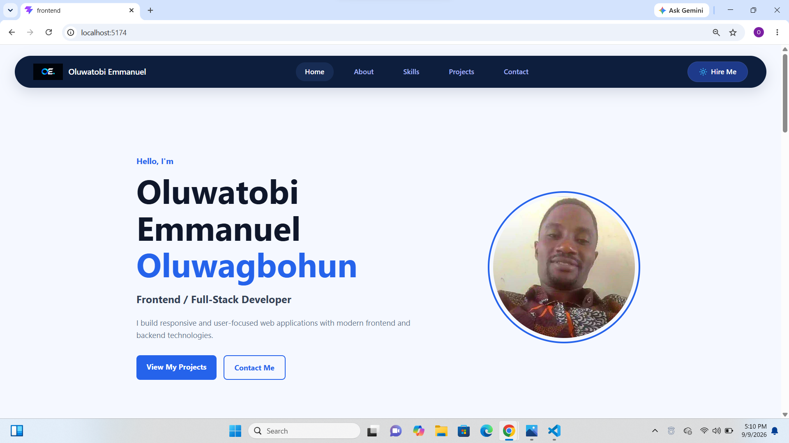

# Personal Portfolio Website

A full-stack personal portfolio website built to showcase my skills, projects, and professional background.

📸 Preview

Desktop View



## 🚀 Technologies

### Frontend
- React
- JavaScript
- HTML5
- CSS3
- Axios

### Backend
- Node.js
- Express.js
- REST API

### Database
- MongoDB
- Mongoose

## ✨ Features

- Responsive personal portfolio
- About section
- Technical skills section
- Dynamic projects fetched from MongoDB
- Contact form
- Responsive navigation
- Project links to live applications

## 📂 Project Structure

```text
Frontend/
Backend/
README.md